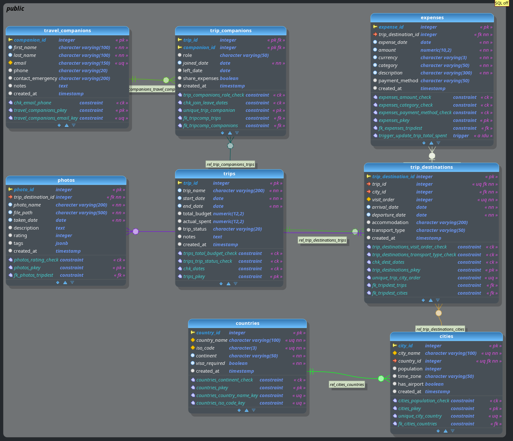

# Travel Diary - Trip Management System

**Описание**  
Десктопное CRUD-приложение для управления путешествиями с функциями учета расходов и списка попутчиков. Поддерживает подключение к PostgreSQL.

**Основные функции**  
- Управление поездками (CRUD операции)

**Требования**  
- Qt6 (Core, Widgets)
- PostgreSQL клиентские библиотеки
- CMake 3.16+
- Компилятор C++17

**Структура проекта**

```
├── CMakeLists.txt
├── main.cpp
├── mainwindow.cpp/.h    # Главное окно
├── database.cpp/.h      # Работа с БД
└── create_db.sql        # Схема БД (8 таблиц, триггеры, индексы)
```

**Использование**
1. Запустите приложение
2. Нажмите "Подключиться к БД"
3. Введите параметры (localhost:5432, база: my_travels, пользователь: postgres)
4. Используйте вкладки для управления данными

**Особенности БД**
- 8 связанных таблиц с индексами
- Автоматическое обновление суммы расходов через триггер
- Проверка ограничений (даты, статусы, категории)

